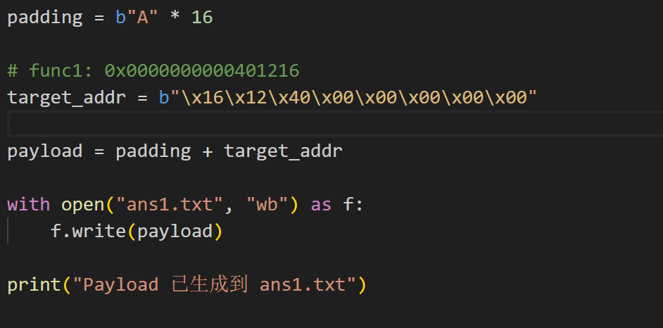
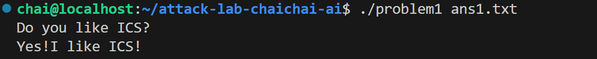
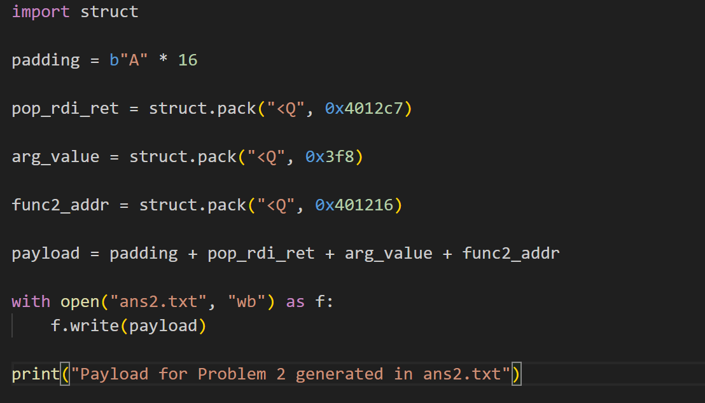
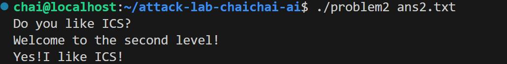
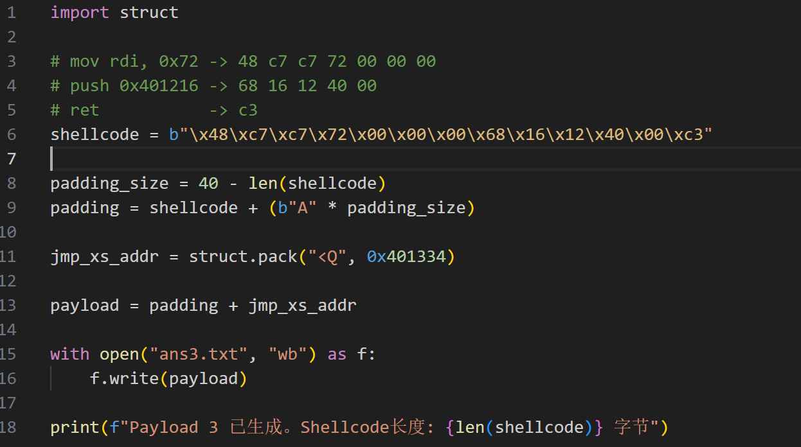
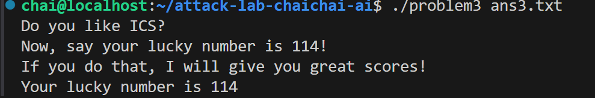
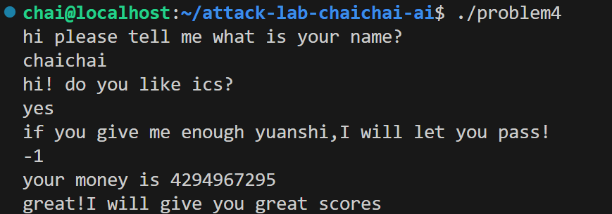

# 栈溢出攻击实验

## 题目解决思路

### Problem 1: 
- **分析**：注意到func函数调用了strcpy。这个函数在拷贝字符串时不检查目标缓冲区的大小。
通过观察汇编指令 lea -0x8(%rbp), %rax，可以发现输入缓冲区在栈上的起始位置距离rbp是8个字节。所以可以输入8字节的填充数据，再加上8字节来覆盖旧的rbp寄存器值，接下来的8个字节就是函数返回地址。
func 1调用了puts打印地址 0x402004 处的字符串，这里应该就是"Yes! I like ICS!"，所以目标是跳转到 func1（地址 0x401216）。
构造payload：
从缓冲区起始位置(rbp-8)到rbp底部需要8字节，覆盖rbp需要8字节，接下来紧跟着的8字节就是返回地址。
所以构造8(缓冲区)+8(覆盖rbp)=16字节的填充字符，然后紧跟要跳转的地址0x0000000000401216。
- **解决方案**：
- **结果**：

### Problem 2:
- **分析**：
函数func(0x401290)：使用 memcpy 将输入拷贝到 rbp-0x8 的位置，但拷贝长度被硬编码为 0x38 (56字节)。由于缓冲区只有8字节，产生了溢出。
func2(0x401216)：
检查第一个参数（rdi）是否等于0x3f8。如果相等，则输出成功提示。
关键 Gadget pop_rdi (0x4012c7)：
在pop_rdi函数中，指令pop %rdi；ret；从栈顶取一个值放进rdi，然后通过ret跳转到下一个目标。
构造payload（Padding(16B) + pop_rdi_addr + 0x3f8 + func2_addr）：
Padding填满缓冲区和旧rbp；由于开启了NX保护，栈上数据不可执行，必须利用已有的代码片段，所以将返回地址改到pop_rdi_addr，程序会执行 pop %rdi；执行pop时，栈指针指向0x3f8的位置，该值被存入rdi；执行pop后的ret指令读取栈顶的下一个8字节地址，这里应该放func2的地址，从而带着我们修改好的的参数进入func2输出"Yes! I like ICS!"

- **解决方案**：
- **结果**：

### Problem 3: 
- **分析**：
漏洞函数 func (0x401355)：
该函数分配了0x30的栈空间，缓冲区位于rbp-0x20。这个函数把栈顶指针%rsp保存到了全局变量saved_rsp (0x403510)中。
jmp_xs(0x401334)：取出saved_rsp的值并加上0x10，然后跳转过去。rbp-0x20等于saved_rsp+0x10。这意味着调用jmp_xs就会让程序跳转回我输入的缓冲区开头。
func1(0x401216)：要求第一个参数rdi为0x72（十进制114），相等则打印lucky number。
构造payload：
Shellcode：放在缓冲区的最开头。功能是让rdi=0x72并跳转到func1。
Padding：填充到40字节（从缓冲区rbp-0x20到返回地址rbp+0x08的距离是32+8=40字节）。
返回地址：覆盖为jmp_xs的地址 (0x401334)。
把以下代码转换成16进制
mov rdi, 0x72          ; 设置参数为 114
push 0x401216          ; 将 func1 的地址压栈
ret                    ; 返回（即跳转）到 func1
得到：\x48\xc7\xc7\x72\x00\x00\x00\x68\x16\x12\x40\x00\xc3
- **解决方案**：
- **结果**：

### Problem 4: 
- **分析**：
canary的保护机制：
136c: 64 48 8b 04 25 28 00    mov    %fs:0x28,%rax  # 从段寄存器 fs 的 0x28 偏移处读取随机值
1375: 48 89 45 f8             mov    %rax,-0x8(%rbp) # 将该值压入栈中

140e: 64 48 2b 04 25 28 00    sub    %fs:0x28,%rax  # 将栈里的值与原始随机值做减法
1417: 74 05                   je     141e           # 如果结果为 0（相等），说明没被破坏，正常跳转
1419: e8 b2 fc ff ff          call   10d0 <__stack_chk_fail@plt> # 否则，触发报错
func函数（0x135d）逻辑：
main函数通过scanf读取一个整数，并作为参数传递给func。
[rbp-0xc] 是第一个输入。
[rbp-0x18] 是第二个输入。
[rbp-0x10] 初始化为0xfffffffe（-2）。
循环计算：程序进入一个循环，循环次数由[rbp-0x10]决定，每次循环中[rbp-0x18]减 1。
胜利条件：
条件 1：[rbp-0x18] 必须等于 1。
条件 2：[rbp-0xc] 必须等于 0xffffffff（即 -1）。
根据条件2，输入必须是-1。如果输入是-1，初始时[rbp-0x18]=-1。经过循环，减去0xfffffffe次，-1-(-2)=1，刚好满足条件 1。
- **解决方案**：在要求给出原石时输入-1
- **结果**：
## 思考与总结
栈布局的精确分析是所有攻击的基础。通过实验我理解了函数调用栈是如何被利用来攻击的，以及在这个过程中栈的情况。
对于NX保护，我学会了利用程序已有的代码片段来拼凑出攻击逻辑。
对于地址随机化时，我意识到了寻找稳定跳转目标（jmp_xs）的重要性。
我也更深刻理解了Canary保护的原理，这对防止栈溢出具有重大意义。
在未来编写代码中，我也应该注意到这些安全问题，关注不安全的函数（strcpy, scanf等）。应该使用带有边界检查的函数并使用Canary，NX等。

## 参考资料

列出在准备报告过程中参考的所有文献、网站或其他资源，确保引用格式正确。
